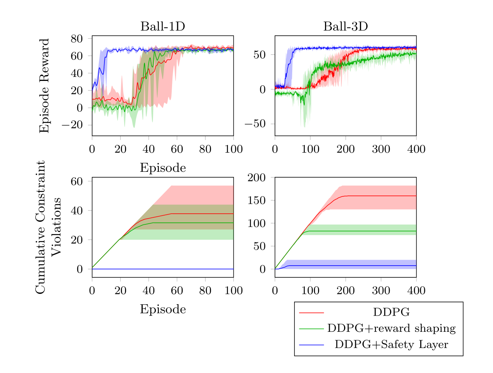

# Implementation of "Safe Exploration in Continuous Action Spaces"

## Introduction

This repository contains Pytorch implementation of paper ["Safe Exploration in Continuous Action Spaces" (Dalal et al., 2018)](https://arxiv.org/pdf/1801.08757.pdf). 

## Setup

The code requires Python 3.6+ and is tested with torch 1.1.0. To install dependencies run the following command.
```sh
pip install -r requirements.txt
```

## Training

A list of parameters and their default values is printed with the following command.
```sh
python -m safe_explorer.main --help
```

With the following command the agent is trained on the ball domain.
```sh
python -m safe_explorer.main --main_trainer_task ballnd
```
... on spaceship domain.
```sh
python -m safe_explorer.main --main_trainer_task spaceship
```

The training can be monitored via Tensorboard with the following command.
```sh
tensorboard --logdir=runs
```

## Domains

The ball-ND and spaceship domain from (Dalal et al., 2018) are implemented in custom [OpenAI gym](https://gym.openai.com/) environments (see ```safe-explorer/env```).

### Ball-ND Domain

For the 1D- & 3D-case ```env.render()``` is implemented to give a visual output. The green circle depicts the agent's ball and the red circle depicts the target.


### Spaceship Domain

TODO

## Results

I managed to get similiar results to (Dalal et al., 2018).



### Ball-1D parameters

#### Domain parameters

```
- n=1
- target_margin=0.2
- agent_slack=0.1
- episode_length=30
- time_step=0.1
- respawn_interval=2
- target_noise_std=0.05
- enable_reward_shaping=false
- reward_shaping_margin=0.14  
- control_acceleration=false     
```

### DDPG parameters

```
- epochs=500
- training_episodes_per_epoch=1
- evaluation_episodes_per_epoch=1
- batch_size=256
- memory_buffer_size=1000000
- gamma=0.99
- tau=0.001 
- reward_scale=1.0
- actor_layers=[64,64]
- critic_layers=[256,256]
- actor_lr=0.0001
- critic_lr=0.001
- actor_weight_decay=0.0
- critic_weight_decay=0.01
```

#### Safety Layer parameters

```
- layers=[10]
- epochs=10
- training_steps_per_epoch=1000
- evaluation_steps_per_epoch=20
- sample_data_episodes=1000
- batch_size=256
- memory_buffer_size=1000000
- lr=0.001
- correction_scale=5.0
```
### Ball-3D parameters

#### Domain parameters

```
- n=3
- target_margin=0.2
- agent_slack=0.1
- episode_length=30
- time_step=0.1
- respawn_interval=2
- target_noise_std=0.05
- enable_reward_shaping=false
- reward_shaping_margin=0.14  
- control_acceleration=false     
```

### DDPG parameters

```
- epochs=500
- training_episodes_per_epoch=1
- evaluation_episodes_per_epoch=1
- batch_size=256
- memory_buffer_size=1000000
- gamma=0.99
- tau=0.001 
- reward_scale=10.0
- actor_layers=[64,64]
- critic_layers=[256,256]
- actor_lr=0.0001
- critic_lr=0.001
- actor_weight_decay=0.0
- critic_weight_decay=0.01
```

#### Safety Layer parameters

```
- layers=[10]
- epochs=10
- training_steps_per_epoch=1000
- evaluation_steps_per_epoch=20
- sample_data_episodes=1000
- batch_size=256
- memory_buffer_size=1000000
- lr=0.001
- correction_scale=5.0
```

## References
- Dalal, G., K. Dvijotham, M. Vecerik, T. Hester, C. Paduraru, and Y. Tassa (2018). “Safe Exploration in Continuous Action Spaces.” In: CoRR abs/1801.08757. arXiv: 1801.08757.

- Lillicrap, T. P., J. J. Hunt, A. Pritzel, N. Heess, T. Erez, Y. Tassa, D. Silver, and D. Wierstra (May 2016). “Continuous control with deep reinforcement learning.” In: 4th International Conference on Learning Representations, (ICLR 2016), Conference Track Proceedings. Ed. by Y. Bengio and Y. LeCun. ICLR’16. San Juan, Puerto Rico.

## Acknowledgements

This repository was originally a fork from https://github.com/AgrawalAmey/safe-explorer. I have re-implemented most of the DDPG, Safety Layer, and domains, therefore I have detached the fork. Some parts concerning the structure of the repository are reminiscent from the original fork.

The *Deep Determinitic Policy Gradient* (DDPG) (Lillicrap et al., 2016) implementation is based on this implementation: [Deep Deterministic Policy Gradients Explained](https://towardsdatascience.com/deep-deterministic-policy-gradients-explained-2d94655a9b7b).
