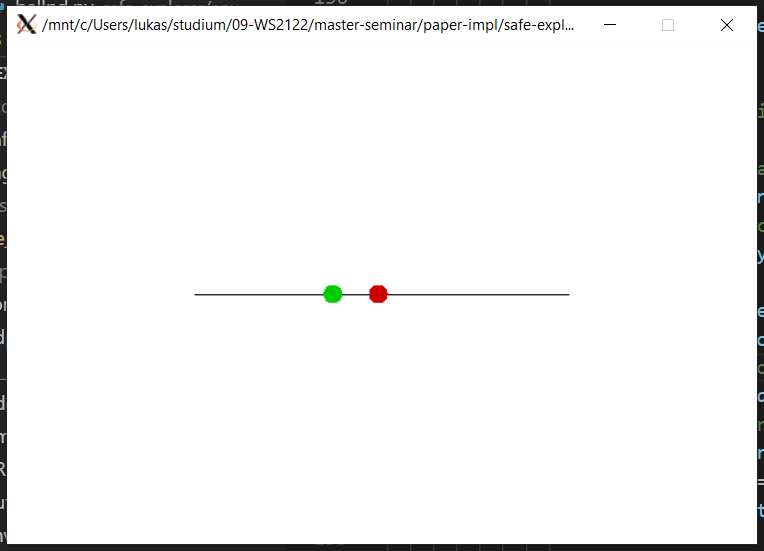

# Implementation of "Safe Exploration in Continuous Action Spaces"

## Introduction

This repository contains Pytorch implementation of paper ["Safe Exploration in Continuous Action Spaces" [Dalal et al.]](https://arxiv.org/pdf/1801.08757.pdf). 

## Setup

The code requires Python 3.6+ and is tested with torch 1.1.0. To install dependencies run the following command.
```sh
pip install -r requirements.txt
```

## Training

A list of parameters and their default values is printed with the following command.
```sh
python -m safe_explorer.main --help
```

## Domains

The ball-ND and spaceship domain from [Dalal et al.] are implemented in custom [OpenAI gym](https://gym.openai.com/) environments (see ```safe-explorer/env```).

### Ball-ND Domain

The agent is trained by running the following command.
```sh
python -m safe_explorer.main --main_trainer_task ballnd
```

The training can be monitored via Tensorboard with the following command.
```sh
tensorboard --logdir=runs
```

For the 1D- & 3D-case ```env.render()``` is implemented to give a visual output. The green circle depicts the agent's ball and the red circle depicts the target.




### Spaceship Domain

TODO

## Results

To be updated.

## References
- Dalal, Gal, Krishnamurthy Dvijotham, Matej Vecerik, Todd Hester, Cosmin Paduraru, and Yuval Tassa (2018). “Safe Exploration in Continuous Action Spaces”. In: CoRR abs/1801.08757. arXiv: 1801.08757. url: http: //arxiv.org/abs/1801.08757.

- Lillicrap, Timothy P., Jonathan J. Hunt, Alexander Pritzel, Nicolas Manfred Otto Heess, Tom Erez, Yuval Tassa, David Silver, and Daan Wierstra (2016). “Continuous control with deep reinforcement learning”. In: CoRR abs/1509.02971.

## Acknowledgements

This repo was originally a fork from https://github.com/AgrawalAmey/safe-explorer. I have re-implemented most of the DDPG, Safety Layer, and domains, therefore I have detached the fork. Some parts of the code are still reminiscent of the original fork.

The *Deep Determinitic Policy Gradient* (DDPG) [2] implementation is based on this implementation: [Deep Deterministic Policy Gradients Explained](https://towardsdatascience.com/deep-deterministic-policy-gradients-explained-2d94655a9b7b).
